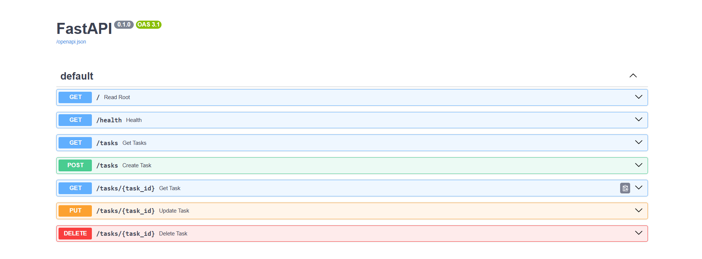

# Task API

> A production-style REST API for managing tasks — built with FastAPI & Python.

---

## What is this?

A full CRUD API that lets you create, read, update, and delete tasks.
Built from scratch as part of the **FlyRank Backend Engineering Track — Week 2**.

Tasks are stored in memory — no database yet. Data resets on server restart.

---

## Tech Stack

| Tool | Purpose |
|------|---------|
| Python 3.11 | Core language |
| FastAPI | Web framework |
| Pydantic | Data validation |
| Uvicorn | ASGI server |

---

## Installation & Setup

**1. Clone the repository**
```bash
git clone https://github.com/YOUR_USERNAME/todo-api.git
cd task-api
```

**2. Create and activate virtual environment**
```bash
python -m venv venv
venv\Scripts\activate
```

**3. Install dependencies**
```bash
pip install fastapi uvicorn
```

**4. Run the server**
```bash
uvicorn main:app --reload
```

**5. Open in browser**
---

## API Endpoints

| Method | Path | Description | Status Code |
|--------|------|-------------|-------------|
| `GET` | `/` | API information | `200` |
| `GET` | `/health` | Server health check | `200` |
| `GET` | `/tasks` | Get all tasks | `200` |
| `GET` | `/tasks/{id}` | Get a single task by ID | `200` |
| `POST` | `/tasks` | Create a new task | `201` |
| `PUT` | `/tasks/{id}` | Update an existing task | `200` |
| `DELETE` | `/tasks/{id}` | Delete a task | `204` |

---

## Example Request & Response

```bash
curl -i http://127.0.0.1:8000/tasks
```
```
HTTP/1.1 200 OK
date: Thu, 16 Jul 2026 17:49:00 GMT
server: uvicorn
content-length: 117
content-type: application/json

[{"id":1,"title":"Task 1","done":true}...]
```
---

## Status Codes

| Code | Meaning |
|------|---------|
| `200` | Success |
| `201` | Created |
| `204` | Deleted — no content returned |
| `400` | Bad Request — invalid input |
| `404` | Not Found — task doesn't exist |

---

## Interactive Docs (Swagger UI)

FastAPI generates interactive documentation automatically.

👉 Visit: `http://127.0.0.1:8000/docs`



---

## Validation Rules

- `title` is required for POST and PUT
- Empty or blank titles are rejected with `400 Bad Request`
- Unknown task IDs return `404 Not Found`

---

## Author

**Bassam Khalid**  
FlyRank Backend Engineering Track — Week 2