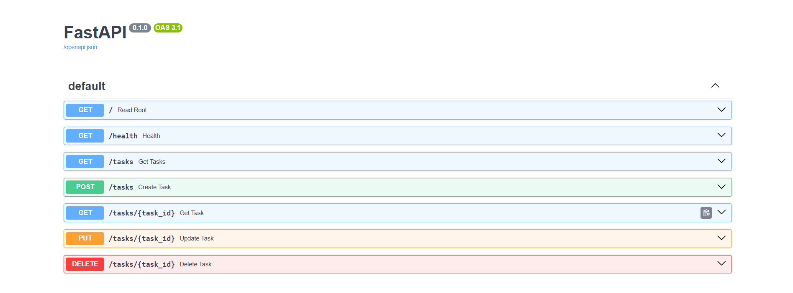
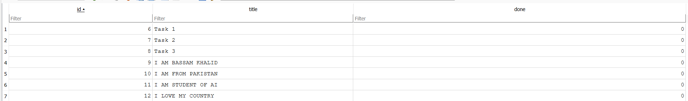

# Task API

> A production-style REST API for managing tasks — built with FastAPI & SQLite.

---

## What is this?

A full CRUD API that lets you create, read, update, and delete tasks.
Built as part of the **FlyRank Backend Engineering Track — Week 3 (A2)**.

Tasks are stored in **SQLite** (`tasks.db`) — a single file database.
Data persists across server restarts automatically.

---

## Why SQLite?

- Zero setup — no server to install or run
- Single file (`tasks.db`) created automatically on first run
- Perfect for development, testing, and lightweight applications
- Data survives server restarts

---

## How to Run

**1. Clone the repository**
```bash
git clone https://github.com/Bassamkhalid011/todo-api.git
cd todo-api
git checkout a2-sqlite
```

**2. Create and activate virtual environment**
```bash
python -m venv venv
venv\Scripts\activate
```

**3. Install dependencies**
```bash
pip install fastapi uvicorn
```

**4. Run the server**
```bash
uvicorn main:app --reload
```

**5. Open in browser**
```
http://127.0.0.1:8000/docs
```

Database (`tasks.db`) is created automatically — no manual setup needed.

---

## API Endpoints

| Method | Path | Description | Status Code |
|--------|------|-------------|-------------|
| `GET` | `/` | API information | `200` |
| `GET` | `/health` | Server health check | `200` |
| `GET` | `/tasks` | Get all tasks | `200` |
| `GET` | `/tasks/{id}` | Get a single task by ID | `200` |
| `POST` | `/tasks` | Create a new task | `201` |
| `PUT` | `/tasks/{id}` | Update an existing task | `200` |
| `DELETE` | `/tasks/{id}` | Delete a task | `204` |

---

## Example Request & Response

```bash
curl -i http://127.0.0.1:8000/tasks
```
```
HTTP/1.1 200 OK
content-type: application/json

[{"id":1,"title":"Task 1","done":0}]
```

---

## Status Codes

| Code | Meaning |
|------|---------|
| `200` | Success |
| `201` | Created |
| `204` | Deleted — no content returned |
| `400` | Bad Request — invalid input |
| `404` | Not Found — task doesn't exist |

---

## Validation Rules

- `title` is required for POST and PUT
- Empty or blank titles are rejected with `400 Bad Request`
- Unknown task IDs return `404 Not Found`

---

## Example SQL Query

```sql
SELECT * FROM tasks WHERE done = 1;
```

This query returns all completed tasks directly from the SQLite database.
Running it in DB Browser while the API is live shows the same data — one source of truth.

---

## Persistence Proof

1. Started the server with `uvicorn main:app --reload`
2. Created tasks via POST `/tasks`
3. Stopped the server with `CTRL+C`
4. Restarted the server
5. GET `/tasks` returned the same tasks ✅

Data survives server restarts because it lives in `tasks.db` on disk.

---

## Interactive Docs (Swagger UI)

FastAPI generates interactive documentation automatically.

👉 Visit: `http://127.0.0.1:8000/docs`



---

## Database Screenshot



---

## Project Structure

```
todo-api/
├── main.py          # FastAPI app + SQLite logic
├── models.py        # Pydantic models
├── tasks.db         # SQLite database (auto-created, git-ignored)
├── requirements.txt # Dependencies
├── .gitignore       # Ignores .env, tasks.db, venv
├── swagger.png      # Swagger UI screenshot
├── db-screenshot.png # DB Browser screenshot
└── README.md
```

---

## Author

**Bassam Khalid**  
FlyRank Backend Engineering Track — Week 3 · Assignment A2