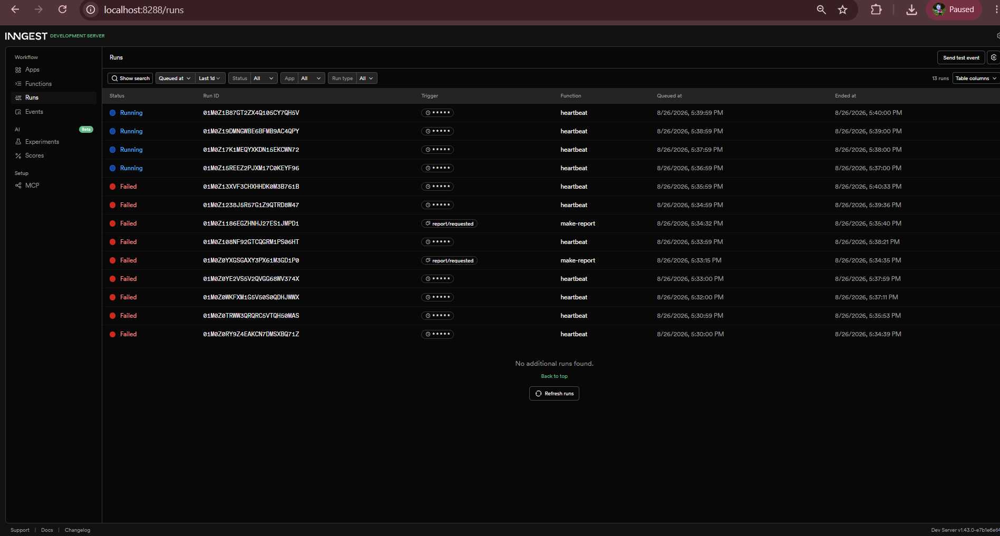

# FlyRank Background Job API — W6 Assignment A7

A small FastAPI service that accepts report requests instantly, processes them in a background job using Inngest, and exposes a status endpoint so clients can poll for results. One cron job runs every minute to log a summary — with no request involved at all.

## How to run

**Terminal 1 — API server:**
```bash
uvicorn main:app --reload --port 8000
```

**Terminal 2 — Inngest Dev Server:**
```bash
npx inngest-cli@latest dev -u http://localhost:8000/api/inngest
```

Inngest dashboard: http://localhost:8288

## Setup

```bash
cd background-job
python -m venv venv
venv\Scripts\activate      # Windows
pip install -r requirements.txt
cp .env.example .env
```

## Endpoints & functions

| Type | Name | Trigger | Description |
|------|------|---------|-------------|
| GET | `/health` | request | Returns `{"status": "ok"}` |
| POST | `/reports` | request | Creates a background report job, returns 202 + id immediately |
| GET | `/reports/{id}` | request | Returns report status (`pending` → `done`) or 404 |
| `make-report` | event: `report/requested` | background | Sleeps 8 s then builds the report result |
| `say-hello` | event: `test/hello` | background | Demo function — sleeps 5 s, returns a greeting |
| `heartbeat` | cron: every minute | scheduled | Logs count of pending, done, and total reports |

## Proof — 202 then poll

```
POST /reports  →  202 in milliseconds
{"id": "abc-123", "status": "pending"}

GET /reports/abc-123  →  (immediately after)
{"id": "abc-123", "topic": "cats", "status": "pending", "result": null}

GET /reports/abc-123  →  (~10 seconds later)
{"id": "abc-123", "topic": "cats", "status": "done", "result": "Report on cats — generated at 2026-08-26 ..."}
```

## Stage 3 — bad input vs retry

Bad input is rejected at the door with 400 — no job is created. A temporary failure inside the job gets retried because the input was valid but the moment was wrong.

## Stage 4 — cron expressions

- Every day at 08:00: `0 8 * * *`
- Every Sunday at 22:00: `0 22 * * 0`

## Dashboard screenshot



The screenshot shows:
- `make-report` completed run with `do-the-slow-work` and `build-report` steps
- A failed run (topic: "fail") — 3 attempts, final status: Failed
- `heartbeat` cron runs, one minute apart

## Folder structure

```
background-job/
├── main.py           # FastAPI app + /health, POST /reports, GET /reports/{id}
├── inngest_client.py # Inngest client (app_id: report-api)
├── functions.py      # say-hello, make-report, heartbeat
├── store.py          # Shared in-memory reports dict
├── requirements.txt
└── .env.example
```
